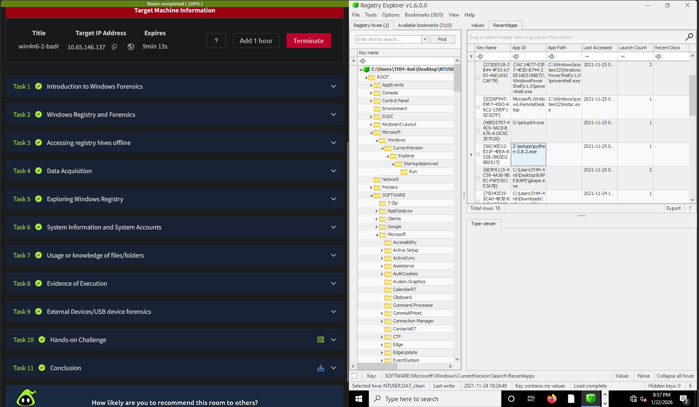
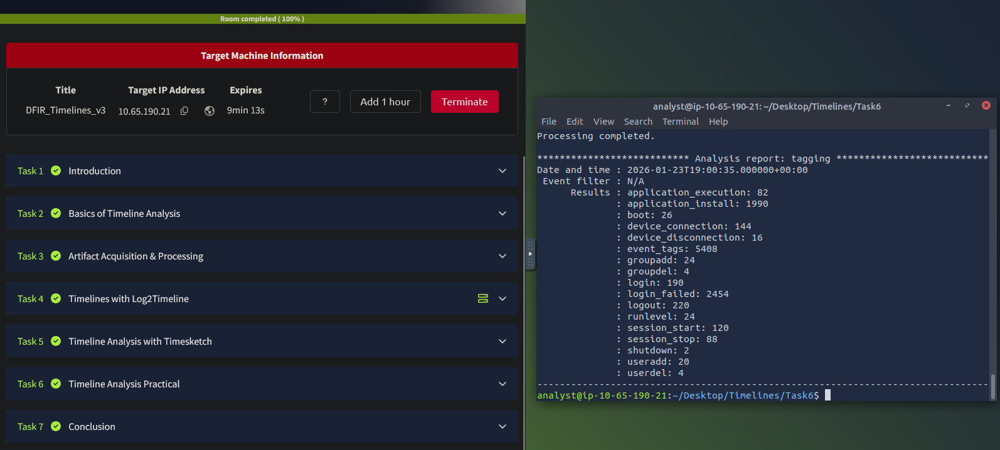
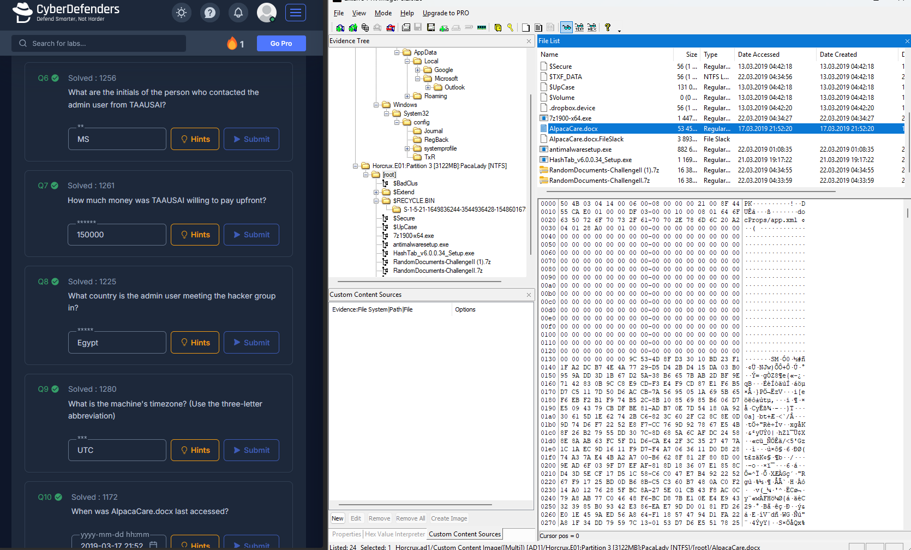
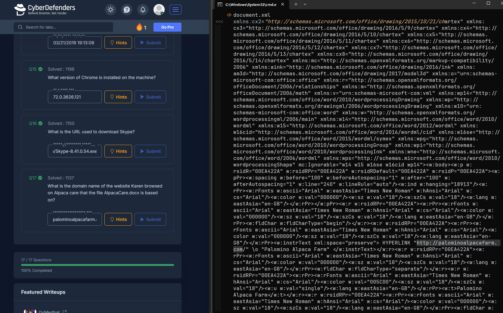

# Digital Forensics and Incident Response

## 1. TryHackMe: Windows Forensics & Timeline Analysis
These labs focused on extracting Windows artifacts and building chronological timelines to track system activity.

* **Registry Analysis:** Learned that analyzing a live registry is limited by OS file locks. By extracting hive files (like `NTUSER.DAT`) and using Registry Explorer, I successfully analyzed historical user activity, including exact program execution counts.
* **Timeline Generation:** Used `log2timeline` and Timesketch to process raw disk data into structured timelines. This demonstrated how to correlate system logs with file system activity to track an attacker's movements chronologically.

*Extracting program execution history from NTUSER.DAT.*

*Correlating system events using Timesketch.*

---

## 2. CyberDefenders: HireMe Challenge
I performed a forensic investigation on a full disk image to reconstruct a user's activity and identify malicious indicators. 

The main takeaway was learning to pivot between different types of forensic artifacts to build a complete picture of an incident.
* Extracted the hostname, OS build, and UTC timezone from the `SYSTEM` and `SOFTWARE` registry hives. Used DB Browser for SQLite to pull user zip codes from Chrome's autofill databases.
* Parsed Outlook data files to uncover a suspicious job offer, salary negotiations, and a secret passphrase (`TheCardCriesNoMore`) linked to a threat actor group.
* Examined the internal XML structure of an `AlpacaCare.docx` file, bypassing the standard document viewer to locate a hidden malicious hyperlink.

*Analyzing Outlook data files and system structures in FTK Imager.*

*Extracting hidden URLs from the internal XML structure of a Word document.*

